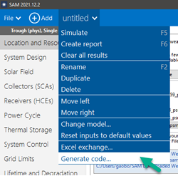
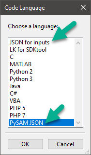

Importing Inputs from SAM
==========================

Because of the large number of inputs required to run most PySAM models, it may be impractical to set up a model in PySAM without using SAM's code generator. For example, the Physical Trough -- Single Owner configuration requires four compute modules (TroughPhysical, Grid, Utilityrate5, and Singleowner) and about 500 inputs. When you use SAM's code generator to import inputs from SAM into your PySAM model, SAM's user interface ensures that you correctly assign values to the inputs for each of the compute modules required for your model. Once you import the inputs, you can modify them as needed for your analysis.

.. warning::

    When you change the value of one or more inputs after importing them from SAM, be careful to check for dependencies between variables. See :doc:`interdependent-variables` for details.

SAM Code Generator
-------------------

SAM's code generator exports data from a SAM case to JSON files or to a package of files for several programming and scripting languages. The **PySAM JSON** and **JSON for inputs options** described below work with PySAM. The **Python 2** and **Python 3** options described in :doc:`pyssc` work with Python when you want direct access to SSC without using the PySAM package.

To open the code generator, in SAM, click **Generate code** on the case menu:

Choose an option for exporting the inputs:

- **PySAM JSON** exports inputs to a separate JSON file for each compute module.

- **JSON for inputs** exports inputs to a single JSON file.

PySAM JSON
-----------

The **PySAM JSON** code generator option creates a separate JSON file for each compute module. To use the option:

.. warning::

    In some cases the output of one compute module may be the input to one or more downstream modules, and a downstream module may change its value. For example, the PVWatts -- Commercial configuration in the example below executes the Pvwattsv8, Grid, Utilityrate5, and Cashloan compute modules in that order. The time series power output of the system, ``gen`` is an output of :doc:`modules/Pvwattsv8`, both an input and output of :doc:`modules/Grid`, and an input to :doc:`modules/Utilityrate5` and :doc:`modules/Cashloan`. When you load inputs from a separate JSON file for each module, be sure your code loads inputs for all modules first, then sets the inputs for all modules, and finally executes the modules (in the correct order) to ensure the values of any shared variables are correctly assigned.

    :
        1. Load the inputs from the JSON files for all of the modules in the configuration.
        2. Change values of any inputs as needed.
        3. Execute the modules (in the correct order).

To see how the PySAM JSON option works, let's export SAM inputs for a PVWatts -- Commercial case. First create the case in SAM, and then use the code generator with the **PySAM JSON** option. SAM prompts you to choose a folder and saves a JSON file for each compute module required for that configuration, in this case:  Pvwatts8, Grid, Utilityrate5, and Cashloan. SAM saves each JSON file as ``<case name>_<compute module name>.json``. It uses the SSC compute module name, which varies slightly from the PySAM compute module name, so "pvwattsv8" instead of "Pvwattsv8". Be sure to use the PySAM name when you refer to the compute module in your Python code.

.. note::

    SAM's code generator also saves a copy of the SSC library files (``ssc.dll`` and ``sscapi.h`` in Windows) for the version of SAM that generated the code. You don't need to use these files, but they may be useful in the future if you update SAM and/or PySAM and need access to the original libraries you used to create your model. See :doc:`pyssc`.

Next, look up the correct order of execution for the compute modules in (:doc:`sam-configurations`).

The first step in your Python script is to import the modules you need from PySAM. You may want to put the import statements in the correct order to help you remember the order. We also need the ``json`` package to read the JSON files.

.. code:: python

    import json
    import PySAM.Pvwattsv8 as PVWatts
    import PySAM.Grid as Grid
    import PySAM.Utilityrate5 as UtilityRate
    import PySAM.Cashloan as Cashloan

Next, create the PySAM model. Use ``new()`` to create an instance of the first compute module in the execution order, and then use ``from_existing()`` for the subsequent modules so that all of the compute modules share the same data. This ensures that downstream modules can access any data required of upstream modules. For example ``grid`` requires the ``gen`` input, which is an output of the upstream ``pv`` module:

.. code:: python

    pv = PVWatts.new()
    grid = Grid.from_existing(pv)
    ur = UtilityRate.from_existing(pv)
    cl = Cashloan.from_existing(pv)

Now create lists to refer to the JSON files and compute modules:

.. code:: python

    dir = "/path/to/json/files/"
    file_names = ["untitled_pvwattsv7", "untitled_grid", "untitled_utilityrate5", "untitled_cashloan"]
    modules = [pv, grid, ur, cl]

Then loop through the inputs for each module, and use ``value()`` to set the value of each input:

.. code:: python

    for f, m in zip(file_names, modules):
        with open(dir + f + ".json", 'r') as file:
            data = json.load(file)
            # loop through each key-value pair
            for k, v in data.items():
                if k != "number_inputs":
                    m.value(k, v)

Now we are ready to run the modules in the correct order and get results:

.. code:: python

    for m in modules:
        m.execute()

    print('ac_gross: ', pv.Outputs.ac_gross)
    print('ur_ec_tou_mat: ', ur.ElectricityRates.ur_ec_tou_mat)
    print('cl.Outputs.npv: ', cl.Outputs.npv)

JSON for Inputs
----------------

The **JSON for inputs** code generator option is similar to the **PySAM JSON** option, except that it exports all inputs for the configuration to a single JSON file. The advantage to using this option is that variables that are outputs of one compute module and inputs to another are only assigned once, so you avoid potential confusion of having the module overwrite an input when you run the model. The disadvantage is that you cannot identify what inputs belong to what compute module by looking at the JSON file.

To use the **JSON for inputs** option, follow the instructions above, except when you loop through the inputs, you don't have to loop through the modules:

.. code:: python

    for f, m in zip(file_names, modules):
        with open(dir + f + ".json", 'r') as file:
            data = json.load(file)
            # loop through each key-value pair
            for k, v in data.items():
                if k != "number_inputs":
                    m.value(k, v)
